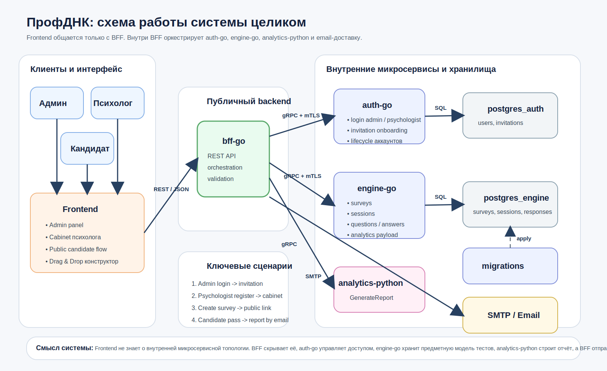

# ProfDNK Platform

Платформа для профориентационного тестирования, в которой:

- администратор управляет доступом психологов;
- психолог собирает тесты в личном кабинете;
- кандидат проходит тест по ссылке без регистрации;
- система формирует персональный отчет и отправляет его на email, указанный при старте теста.

Проект реализован как микросервисная экосистема для MVP хакатона: с понятной доменной декомпозицией, безопасным межсервисным взаимодействием и быстрым локальным запуском.



## Зачем этот проект

`ProfDNK` решает сразу несколько задач в рамках одного продукта:

- помогает психологу быстро собирать и запускать профориентационные тесты;
- отделяет административный контур от клиентского сценария прохождения;
- не требует регистрации от кандидата, только старт сессии;
- не хранит итоговые файлы на сервере: отчет генерируется и отправляется на email;
- поддерживает масштабируемую микросервисную архитектуру, удобную для дальнейшего роста.

## Ключевые преимущества

### 1. Понятное разделение ответственности

Каждый сервис отвечает только за свою предметную область:

- `auth-go` — аутентификация, инвайты, жизненный цикл аккаунтов;
- `engine-go` — конструктор тестов, сессии прохождения, ответы и аналитические данные;
- `analytics-python` — генерация отчетов;
- `bff-go` — единая REST-точка входа для фронтенда и оркестрация всех сценариев.

### 2. Безопасное взаимодействие

- фронтенд работает только с `bff-go`;
- внутренние Go-сервисы взаимодействуют по `gRPC + mTLS`;
- доступ к защищенным кабинетным ручкам идет только по токену;
- клиентский сценарий прохождения теста остается публичным и работает по `sessionId`.

### 3. Практичный MVP

Уже реализованы ключевые пользовательские сценарии:

- bootstrap-администратор при первом запуске;
- приглашение психолога по персональной ссылке;
- регистрация психолога через invitation flow;
- создание и запуск тестов;
- прохождение теста кандидатом;
- получение аналитики;
- генерация и отправка отчета по email.

### 4. Архитектура, удобная для развития

Проект строится вокруг `BFF`, поэтому фронтенд не зависит от внутренних gRPC-контрактов и не знает о внутренней топологии системы. Это упрощает:

- изменение внутренних сервисов без слома UI;
- добавление новых сценариев;
- развитие мобильного клиента или внешнего кабинета в будущем.

## Архитектура системы

### Внешний контур

- `frontend` → работает с `bff-go` по REST/JSON;
- `bff-go` → агрегирует ответы, нормализует ошибки и оркестрирует бизнес-сценарии.

### Внутренний контур

- `auth-go` → управление администраторами и психологами;
- `engine-go` → тесты, вопросы, ответы, сессии;
- `analytics-python` → построение отчетов;
- `postgres_auth` и `postgres_engine` → отдельные БД по bounded context;
- `SMTP` → доставка отчета кандидату.

### Главная идея

Отчет не сохраняется как файл на диске приложения. После завершения теста:

1. `bff-go` забирает аналитику у `engine-go`;
2. передает данные в `analytics-python`;
3. получает готовый отчет;
4. отправляет его кандидату по email.

## Технологический стек

- `Go` — `auth-go`, `engine-go`, `bff-go`
- `Python` — `analytics-python`
- `PostgreSQL`
- `gRPC`
- `REST`
- `mTLS`
- `Docker Compose`
- `Taskfile`

## Состав репозитория

```text
services/
  auth-go/            # авторизация, инвайты, lifecycle пользователей
  engine-go/          # ядро тестовой платформы
  analytics-python/   # генератор отчетов
  bff-go/             # backend-for-frontend
frontend/             # фронтенд-клиент
proto/                # shared gRPC контракты
docs/                 # документация по архитектуре и API
scripts/              # smoke-тесты
```

## Быстрый запуск

### Требования

Нужно установить:

- `Docker` и `Docker Compose`
- `Task` (`go-task`)
- `openssl`

### 1. Подготовить переменные окружения

```bash
cp services/engine-go/.env.example services/engine-go/.env
cp services/auth-go/.env.example services/auth-go/.env
```

Если нужен реальный email-канал, заполни `SMTP_*` в [`services/engine-go/.env`](services/engine-go/.env).

### 2. Сгенерировать сертификаты для mTLS

```bash
task gen-certs OUTPUT=certs
```

В каталоге `certs/` появятся:

- `ca.crt`
- `server.crt`
- `server.key`
- `client.crt`
- `client.key`

### 3. Поднять весь стек

```bash
task rebuild
```

Команда поднимет:

- `postgres_engine`
- `postgres_auth`
- `migrations`
- `test-engine`
- `auth-go`
- `analytics-python`
- `bff-go`

### 4. Проверить, что BFF доступен

```bash
curl http://localhost:8080/health
```

Ожидаемый ответ:

```json
{
  "status": "ok"
}
```

## Данные для первого входа

Bootstrap-администратор создается автоматически при первом запуске `auth-go`.

По умолчанию:

- `email`: `admin@profdnk.local`
- `password`: `admin12345`

Эти значения можно изменить в [`services/auth-go/.env`](services/auth-go/.env).

## Быстрые smoke-тесты

### Проверка auth-flow

```bash
bash scripts/smoke-test-auth-bff.sh
```

Сценарий проверяет:

- логин администратора;
- создание invitation;
- регистрацию психолога;
- получение профилей;
- запрет на изменение профиля психологом;
- изменение профиля психолога администратором;
- block / unblock.

### Проверка основного бизнес-сценария

```bash
bash scripts/smoke-test-bff.sh
```

Сценарий проходит полный путь:

- создание теста;
- старт сессии кандидата;
- прохождение вопросов;
- получение аналитики;
- запуск генерации отчета;
- попытка отправки на email.

## Основные порты

| Сервис | Порт | Назначение |
| --- | --- | --- |
| `bff-go` | `8080` | единая REST-точка входа |
| `engine-go` | `50036` | gRPC ядра платформы |
| `auth-go` | `50037` | gRPC авторизации |
| `analytics-python` | `50051` | gRPC генерации отчетов |
| `postgres_engine` | `5432` | БД конструктора и сессий |

## Что важно для экспертов

### Почему архитектура выбрана именно так

- MVP разделен на независимые доменные сервисы, а не на “монолит с папками”;
- `BFF` изолирует фронтенд от внутренней сложности системы;
- учетные записи и тестовый движок разведены по разным bounded contexts;
- кандидаты не проходят тяжелый auth-flow, что снижает friction;
- админский сценарий и публичный сценарий разделены по безопасности;
- файловое хранилище для отчетов не требуется: это уменьшает риски и упрощает эксплуатацию.

### Что уже демонстрирует зрелость решения

- bootstrap admin;
- invitation-based onboarding психологов;
- статусы аккаунтов: `active`, `inactive`, `blocked`;
- ограничение прав администратора и психолога;
- межсервисное взаимодействие через `gRPC`;
- mTLS для внутреннего Go-to-Go контура;
- документация для фронтенда и интеграций;
- smoke-тесты для ключевых пользовательских путей.

## Полезная документация

- [Схема системы](docs/system-architecture.md)
- [BFF API для фронтенда](docs/bff-api.md)
- [Полный гайд по тестированию](docs/full-testing-guide.md)
- [Интеграция `engine-go`](docs/engine-service-integration.md)
- [Интеграция `auth-go`](docs/auth-service-integration.md)
- [План фронтенда и drag&drop-конструктора](docs/frontend-bff-plan.md)

## Статус проекта

Проект ориентирован на хакатонный MVP, но уже заложен так, чтобы его можно было эволюционно развивать в production-решение:

- усиливать security policy;
- расширять набор типов вопросов;
- добавлять richer analytics;
- подключать полноценный object storage или очередь событий при необходимости;
- развивать веб-кабинет и внешний пользовательский интерфейс без перелома архитектуры.
