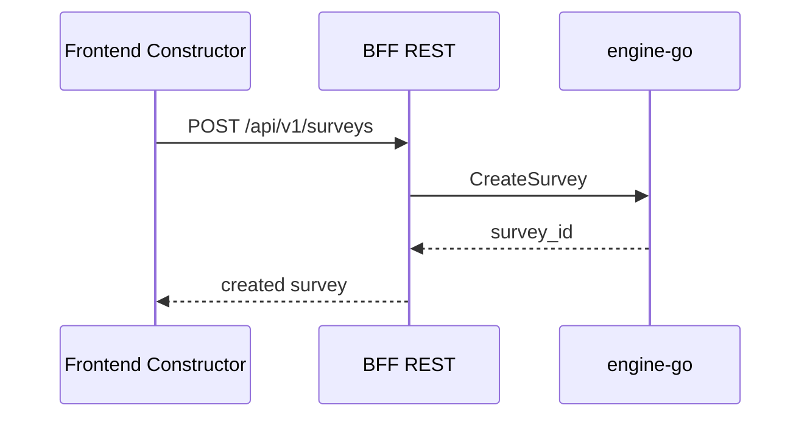
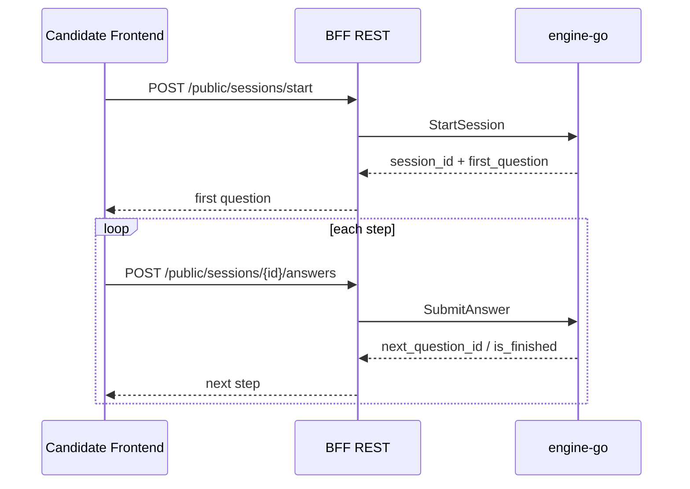
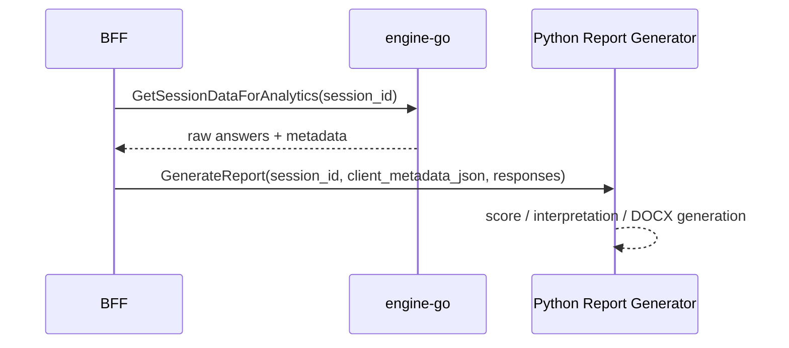

# Engine Service Integration Guide

## 1. Context

`engine-go` — центральный микросервис платформы ПрофДНК. Он отвечает за:

- хранение и публикацию диагностических методик;
- запуск клиентских сессий прохождения теста;
- маршрутизацию по вопросам и логике переходов;
- сбор сырых ответов для аналитики и последующей генерации отчёта.

В рамках кейса из PDF удалось надёжно извлечь первую страницу. Из неё явно следуют обязательные требования MVP:

- удобный конструктор диагностических методик;
- онлайн-прохождение по уникальной ссылке;
- хранение результатов;
- автоматическая генерация отчётов.

Эта документация опирается на:

- фактический `proto` контракт [`test_engine.proto`](/Users/globalarray/hack-rnd-2026-spring/proto/test_engine.proto);
- текущую реализацию `engine-go`;
- видимую часть требований MVP из кейса ПрофДНК.

## 2. Role in System

Сервис находится в центре продуктового сценария:

1. психолог создаёт тест;
2. BFF публикует клиентскую ссылку;
3. клиент проходит тест;
4. результаты сохраняются;
5. ML/генератор DOCX-отчёта получает сырые данные прохождения.

Без `engine-go` не работает ни конструктор, ни клиентское прохождение, ни аналитический экспорт.

## 3. Transport and Security

- Взаимодействие с сервисом идёт по `gRPC`.
- Межсервисное соединение защищено через `mTLS`.
- По умолчанию сервис слушает порт `50036`.
- TLS поднимается в [`app.go`](/Users/globalarray/hack-rnd-2026-spring/services/engine-go/internal/app/app.go) через [`tls.go`](/Users/globalarray/hack-rnd-2026-spring/services/engine-go/pkg/secure/tls.go).

Текущее поведение:

- сервер требует и валидирует клиентский сертификат;
- клиенты сервиса должны доверять `ca.crt`;
- BFF и другие сервисы должны использовать отдельные service-to-service сертификаты.

## 4. External Contract

Сервис публикует 3 gRPC service:

- `SurveyAdminService`
- `SessionClientService`
- `AnalyticsService`

### 4.1 SurveyAdminService

#### `CreateSurvey`

Назначение:

- создать психологический тест вместе с вопросами, ответами и логикой переходов.

Когда вызывает:

- BFF после сохранения конструктора теста.

Ключевые поля:

- `psychologist_id`
- `title`
- `description`
- `settings_json`
- `questions[]`

Возвращает:

- `survey_id`

#### `ListSurveys`

Назначение:

- получить список тестов конкретного психолога.

Когда вызывает:

- BFF при открытии личного кабинета психолога;
- список опросников на экране “Мои тесты”.

Ключевые поля:

- `psychologist_id`

Возвращает:

- список `SurveySummary` с `survey_id`, `title`, `completions_count`

### 4.2 SessionClientService

#### `StartSession`

Назначение:

- создать клиентскую сессию прохождения теста по публичной ссылке и вернуть первый вопрос.

Ключевые поля:

- `survey_id`
- `client_metadata_json`

Особенности:

- сейчас есть защита от повторного старта активной сессии для одинаковой пары `survey_id + client_metadata_json`;
- если активная сессия уже существует, сервис возвращает `AlreadyExists`.

Возвращает:

- `session_id`
- `first_question`

#### `GetCurrentQuestion`

Назначение:

- вернуть текущий активный вопрос для конкретной сессии.

Ключевые поля:

- `session_id`

Возвращает:

- `QuestionClientView`

#### `SubmitAnswer`

Назначение:

- принять ответ клиента, сохранить его и продвинуть сессию к следующему вопросу.

Поддержанные payload:

- `answer_id`
- `raw_text`

Возвращает:

- `next_question_id`
- `is_finished`

Важно:

- `multiple_choice` в `proto` уже объявлен, но в текущей реализации пока явно возвращает `Unimplemented`.

### 4.3 AnalyticsService

#### `GetSessionDataForAnalytics`

Назначение:

- отдать полные сырые данные прохождения теста для ML/аналитики/генерации отчёта.

Ключевые поля:

- `session_id`

Возвращает:

- `survey_id`
- `session_id`
- `client_metadata_json`
- `responses[]`

Текущее рекомендуемое использование:

- `BFF` вызывает `GetSessionDataForAnalytics`
- затем `BFF` передает `responses[]` и `client_metadata_json` в Python report-service по `analytics.proto`
- `client_metadata_json` должен включать `email`, а для персонализации отчёта рекомендуется `fullName`, `full_name` или `fio`

## 5. Primary Business Flows

### 5.1 Create Test

### 5.2 Start and Pass Test

### 5.3 Generate Report

## 6. Data Model

Основные таблицы:

- `surveys`
- `questions`
- `answers`
- `sessions`
- `responses`

Связи:

- один `survey` содержит много `questions`
- один `question` содержит много `answers`
- одна `session` принадлежит одному `survey`
- одна `session` содержит много `responses`

Смысл таблиц:

- `surveys` — оболочка методики;
- `questions` — вопросы и их порядок;
- `answers` — варианты выбора и их веса;
- `sessions` — состояние прохождения;
- `responses` — фактические ответы пользователя.

## 7. Integration Rules for Other Services

### 7.1 For BFF

BFF должен:

- работать с фронтом только по REST;
- быть единственной публичной точкой входа;
- инкапсулировать gRPC и mTLS детали;
- конвертировать REST DTO в gRPC DTO;
- прятать внутренние статусы и ошибки микросервисов.

### 7.2 For Report Generator

Python-сервис не должен читать базу `engine-go` напрямую.

Рекомендуемый контракт:

1. получить `session_id`;
2. запросить `GetSessionDataForAnalytics`;
3. построить интерпретацию;
4. сгенерировать DOCX/PDF;
5. сохранить артефакт в отдельном storage или report-service.

### 7.3 For Future Auth Service

Если позже появится авторизация:

- психологическая часть должна идентифицироваться через BFF;
- `engine-go` должен оставаться доменным сервисом, а не auth-owner;
- `psychologist_id` передаётся как доверенный атрибут от BFF.

## 8. Error Model

Текущая ожидаемая семантика ошибок:

- `InvalidArgument` — ошибка валидации входных данных;
- `AlreadyExists` — повторный старт активной сессии или конфликт в ответе;
- `NotFound` — сессия, вопрос или тест не найдены;
- `FailedPrecondition` — превышен лимит времени;
- `Unimplemented` — пока не реализованный `multiple_choice`.

## 9. Known Constraints

- Брокера сообщений нет, всё строится на синхронных вызовах.
- `multiple_choice` объявлен в `proto`, но пока не поддержан в бизнес-логике.
- Долгие операции генерации отчёта лучше не выполнять inline в BFF.
- При росте нагрузки понадобится отдельный orchestration/report-service слой.

## 10. Recommended Service Boundaries

Чтобы не перегружать `engine-go`, стоит держать его границы такими:

- внутри `engine-go`: тесты, сессии, ответы, сырой аналитический экспорт;
- вне `engine-go`: UI, auth, публичные REST API, генерация файловых отчётов, уведомления.

## 11. What Another Team Member Needs to Know

Если другой микросервис хочет интегрироваться с `engine-go`, ему нужны:

- `proto` контракт;
- mTLS клиентский сертификат;
- адрес gRPC endpoint;
- понимание, в какой момент вызывать каждую ручку;
- отказ от прямого чтения PostgreSQL схемы `engine-go`.

Базовый принцип:

- только `gRPC` между сервисами;
- только `REST` между фронтом и BFF;
- никакого прямого доступа фронта к `engine-go`.
