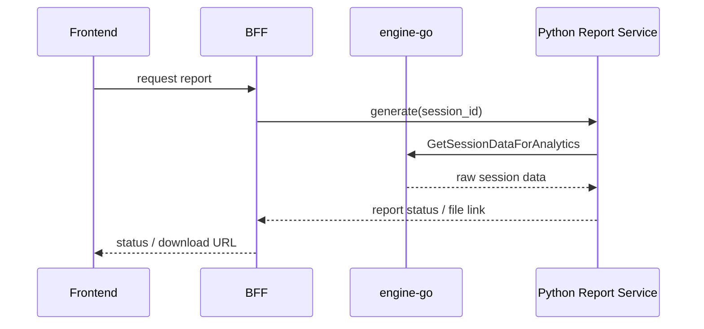

# Frontend and BFF Implementation Plan

## 1. Product Goal

Для MVP ПрофДНК нужно дать психологу понятный онлайн-конструктор методик и дать клиенту простой сценарий прохождения теста по уникальной ссылке.

Из видимой части кейса обязательный MVP включает:

- создание теста в конструкторе;
- отправку ссылки клиенту;
- онлайн-прохождение;
- хранение результатов;
- генерацию отчёта.

## 2. Frontend Vision

Фронтенд лучше разделить на 2 продукта:

- `Psychologist Console`
- `Candidate Flow`

### 2.1 Psychologist Console

Основные экраны:

- логин/вход;
- список тестов;
- конструктор теста;
- просмотр запусков и результатов;
- экран генерации/скачивания отчёта.

### 2.2 Candidate Flow

Основные экраны:

- стартовая анкета;
- экран вопроса;
- завершение теста;
- экран “отчёт готов” или “результаты отправлены психологу”.

## 3. Drag-and-Drop Constructor

Для конструктора нужен именно визуальный редактор, а не просто форма.

### 3.1 Что должно поддерживаться в MVP

- перетаскивание вопросов внутри теста;
- изменение порядка вопросов;
- добавление нового вопроса из панели компонентов;
- редактирование текста вопроса;
- редактирование вариантов ответа;
- настройка логики перехода по ответам;
- предпросмотр клиентского сценария.

### 3.2 Recommended Frontend Stack

- `React`
- `TypeScript`
- `Vite`
- `dnd-kit` для drag-and-drop
- `React Hook Form` для форм
- `Zustand` или `Redux Toolkit` для состояния конструктора
- `TanStack Query` для работы с REST API BFF

Почему `dnd-kit`:

- хорошо подходит под сложные сортируемые списки;
- удобно расширяется под канвас конструктора;
- не привязан к тяжёлой DOM-модели.

### 3.3 UI Structure of Constructor

Конструктор стоит разбить на 3 зоны:

- левая панель: типы вопросов и шаблоны блоков;
- центральный canvas: список вопросов и drag-and-drop reorder;
- правая панель: свойства выбранного вопроса.

### 3.4 Question Types for MVP

- single choice
- multiple choice
- scale
- text

### 3.5 Internal Frontend Model

```ts
type SurveyDraft = {
  id?: string;
  title: string;
  description: string;
  settings: Record<string, unknown>;
  questions: QuestionDraft[];
};

type QuestionDraft = {
  localId: string;
  orderNum: number;
  type: "single" | "multiple" | "scale" | "text";
  text: string;
  answers: AnswerDraft[];
  logicRules: LogicRuleDraft[];
};

type AnswerDraft = {
  id: string;
  text: string;
  weight: number;
  categoryTag?: string;
};

type LogicRuleDraft = {
  answerId: string;
  action: "linear" | "jump" | "finish";
  nextQuestionLocalId?: string;
};
```

### 3.6 Drag-and-Drop Scenarios

- перетащить вопрос вверх/вниз;
- дублировать существующий вопрос;
- удалять вопрос без разрыва порядка;
- drag answer reorder внутри вопроса;
- связывать ответ с переходом на следующий вопрос через визуальную панель логики.

## 4. Frontend Delivery Plan

### Stage 1. Foundation

- поднять роутинг;
- настроить UI-kit;
- подготовить API client к BFF;
- завести auth shell для психолога.

### Stage 2. Constructor MVP

- список тестов;
- создание/редактирование теста;
- drag-and-drop reorder вопросов;
- сохранение в BFF;
- publish/share link.

### Stage 3. Candidate Flow

- публичный экран старта;
- старт сессии;
- прохождение вопрос за вопросом;
- финальный экран.

### Stage 4. Results and Reports

- список прохождений;
- просмотр статуса генерации отчёта;
- скачивание результата.

## 5. BFF Role

BFF на Go нужен как публичный backend для фронта.

Он должен:

- принимать REST запросы от фронта;
- аутентифицировать пользователя;
- собирать несколько внутренних вызовов в один frontend-oriented response;
- общаться с `engine-go` и другими сервисами по `gRPC + mTLS`;
- скрывать внутреннюю микросервисную топологию от фронта.

## 6. Recommended BFF Responsibilities

- REST API для психолога и клиента;
- session/cookie/JWT auth;
- rate limiting публичных ссылок;
- request validation;
- orchestration между `engine-go` и Python report-service;
- нормализация ошибок;
- аудит действий психолога;
- генерация коротких public links.

## 7. Recommended BFF Structure

```text
services/bff-go/
  cmd/bff/main.go
  internal/app/
  internal/config/
  internal/delivery/rest/
  internal/delivery/rest/survey/
  internal/delivery/rest/session/
  internal/delivery/rest/report/
  internal/middleware/
  internal/service/
  internal/service/survey/
  internal/service/session/
  internal/service/report/
  internal/clients/grpc/engine/
  internal/clients/grpc/report/
  internal/clients/http/auth/
  internal/domain/
  pkg/secure/
```

## 8. REST API Surface of BFF

### Psychologist API

- `POST /api/v1/surveys`
- `GET /api/v1/surveys`
- `GET /api/v1/surveys/{surveyId}`
- `PATCH /api/v1/surveys/{surveyId}`
- `POST /api/v1/surveys/{surveyId}/publish`
- `GET /api/v1/surveys/{surveyId}/sessions`
- `GET /api/v1/sessions/{sessionId}/report`

### Candidate API

- `POST /public/v1/sessions/start`
- `GET /public/v1/sessions/{sessionId}/current-question`
- `POST /public/v1/sessions/{sessionId}/answers`
- `GET /public/v1/sessions/{sessionId}/status`

## 9. BFF-to-Microservice Mapping

### Survey operations

- BFF `POST /api/v1/surveys` -> `engine-go.CreateSurvey`
- BFF `GET /api/v1/surveys` -> `engine-go.ListSurveys`

### Session operations

- BFF `POST /public/v1/sessions/start` -> `engine-go.StartSession`
- BFF `GET /public/v1/sessions/{id}/current-question` -> `engine-go.GetCurrentQuestion`
- BFF `POST /public/v1/sessions/{id}/answers` -> `engine-go.SubmitAnswer`

### Report operations

- BFF `GET /api/v1/sessions/{id}/report` -> report-service orchestration
- report-service -> `engine-go.GetSessionDataForAnalytics`

## 10. BFF Service Layer Design

### `survey` use case

Задачи:

- принять frontend draft;
- преобразовать типы и структуру;
- вызвать `CreateSurvey` или `ListSurveys`;
- нормализовать ответ для UI.

### `session` use case

Задачи:

- стартовать прохождение по ссылке;
- хранить/проксировать `session_id`;
- возвращать current question в frontend-friendly форме;
- контролировать сценарии завершения.

### `report` use case

Задачи:

- запустить сбор аналитических данных;
- вызвать Python report generator;
- вернуть status polling или ссылку на готовый документ.

## 11. mTLS in BFF

BFF должен быть полноценным mTLS-клиентом:

- хранить client cert/key;
- доверять `ca.crt`;
- иметь отдельный gRPC client для `engine-go`;
- иметь отдельный клиент для report-service.

Нельзя:

- делать plaintext между BFF и внутренними сервисами;
- переносить сертификаты во frontend;
- открывать `engine-go` напрямую наружу.

## 12. Recommended BFF Error Policy

REST ошибки должны быть человеко-понятными:

- `400` — некорректный ввод
- `401/403` — auth/access
- `404` — объект не найден
- `409` — конфликт состояния, например сессия уже начата
- `422` — бизнес-ограничение
- `500` — внутренняя ошибка

BFF не должен прокидывать сырой текст внутренних gRPC ошибок напрямую в UI.

## 13. Report Generation Flow



## 14. Implementation Roadmap

### Iteration 1

- поднять BFF skeleton;
- настроить mTLS client к `engine-go`;
- реализовать `CreateSurvey`, `ListSurveys`, `StartSession`, `GetCurrentQuestion`, `SubmitAnswer`.

### Iteration 2

- собрать frontend constructor shell;
- реализовать drag-and-drop reorder;
- подключить сохранение теста;
- отдать публичную ссылку.

### Iteration 3

- реализовать candidate flow;
- подключить `AnalyticsService`;
- интегрировать Python report-service.

### Iteration 4

- polishing UI;
- роли и доступы;
- observability;
- retry policies;
- подготовка демо-сценария.

## 15. Practical Recommendation for Hackathon

Чтобы успеть в MVP и не расползтись:

- `engine-go` оставить доменным ядром тестов и сессий;
- BFF делать тонким, но orchestration-friendly;
- фронт сначала собрать вокруг конструктора и сценария прохождения;
- генерацию отчёта вынести в отдельный Python service без прямого доступа к БД `engine-go`.

Главный фокус команды:

- сначала стабильный сценарий `создать тест -> отправить ссылку -> пройти тест -> получить сырой результат`;
- потом уже красивые отчёты, сложные правила и расширенный кабинет аналитики.
