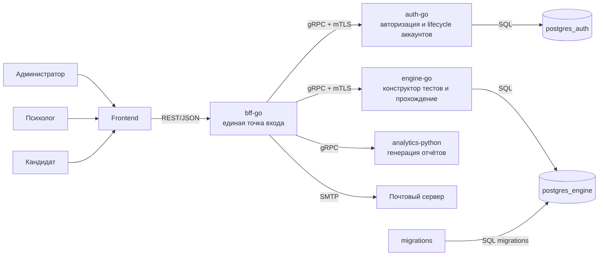
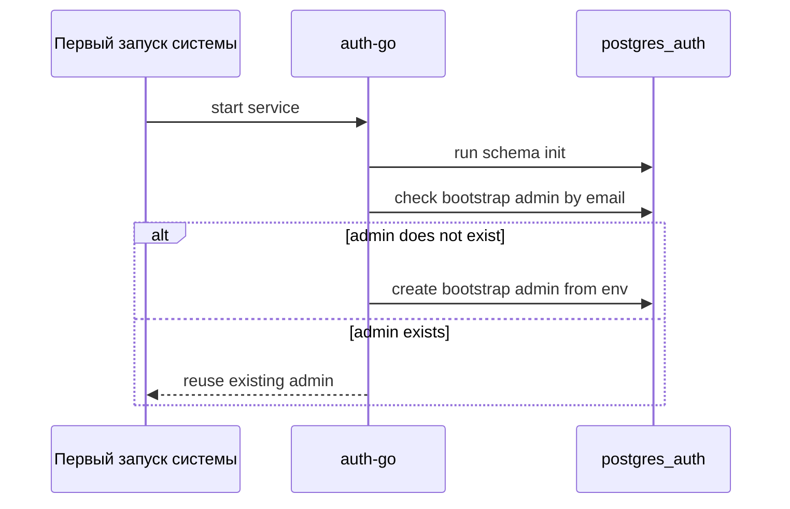
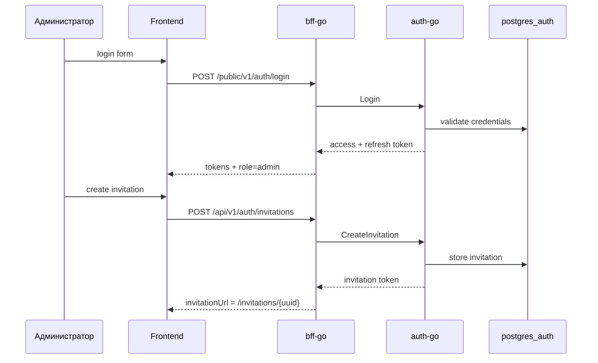
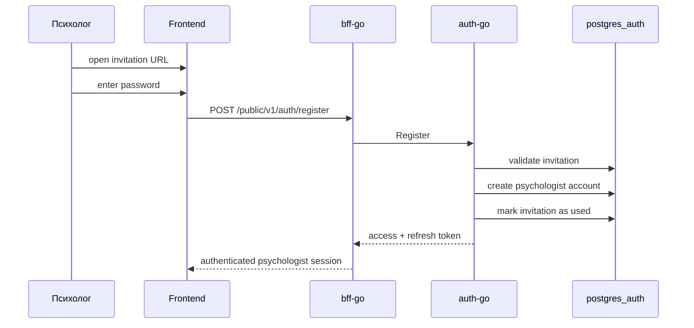
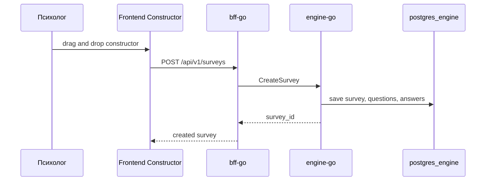
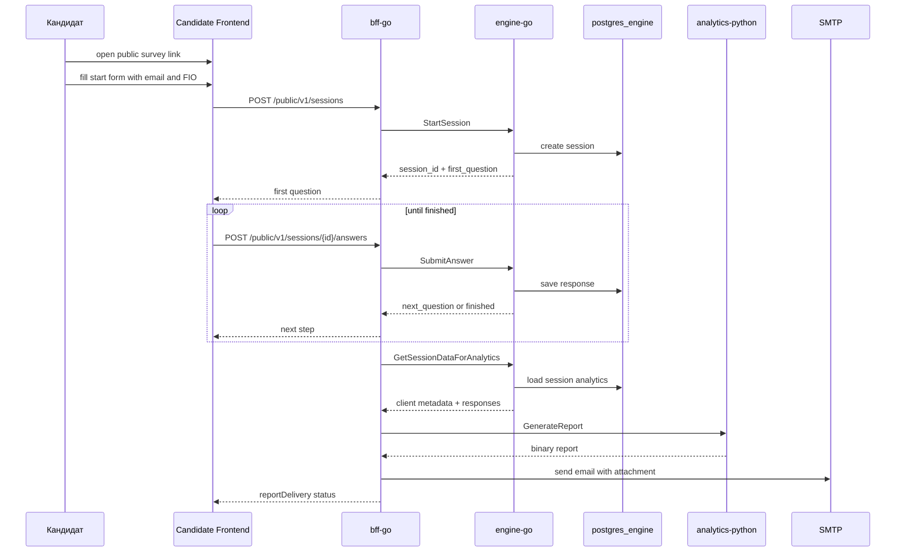

# System Architecture

## Purpose

Этот документ описывает полную схему работы платформы ПрофДНК в текущем MVP-состоянии.

Система построена как микросервисная архитектура без брокера сообщений.

Основной принцип:

- фронт общается только с `bff-go` по REST;
- внутренние Go-сервисы общаются по `gRPC + mTLS`;
- генерация отчёта выполняется отдельным Python-сервисом;
- отчёт не сохраняется на диск сервера, а отправляется клиенту по email.

## High-Level Scheme

## Runtime Boundaries

### External Entry Point

Единственная публичная backend-точка входа:

- `bff-go`

Он отвечает за:

- REST API для frontend;
- orchestration между микросервисами;
- валидацию и нормализацию запросов;
- преобразование внутренних gRPC-ошибок в frontend-friendly HTTP;
- отправку готового отчёта на email.

### Internal Services

#### `auth-go`

Отвечает за:

- единый вход администратора и психолога;
- access/refresh token;
- invitation-based onboarding психологов;
- bootstrap admin при первом запуске;
- блокировку, разблокировку и автоматическую деактивацию аккаунтов по `access_until`.

#### `engine-go`

Отвечает за:

- создание тестов;
- хранение вопросов и ответов;
- запуск сессий;
- возврат текущего вопроса;
- приём ответов;
- сбор аналитических данных по прохождению.

#### `analytics-python`

Отвечает за:

- сборку клиентского или психологического отчёта из сырых ответов;
- генерацию бинарного файла отчёта для последующей email-доставки.

## Main User Flows

### 1. Admin Onboarding Flow

### 2. Admin Creates Psychologist Invitation

### 3. Psychologist Completes Registration

### 4. Psychologist Creates Survey

### 5. Candidate Passes Test and Receives Report

## Data Ownership

### `postgres_auth`

Хранит:

- пользователей;
- роли;
- статусы аккаунтов;
- refresh token;
- invitation records для психологов;
- сроки действия учётных записей.

### `postgres_engine`

Хранит:

- тесты;
- вопросы;
- ответы;
- сессии прохождения;
- client metadata;
- responses;
- агрегированные данные для аналитики.

### `analytics-python`

Не является системным источником правды.

Он:

- не хранит доменные данные;
- получает сырой analytics payload от `bff-go`;
- возвращает готовый отчёт в память.

## Transport and Security Matrix

| Segment | Protocol | Security | Status |
|---|---|---|---|
| Frontend -> BFF | REST/JSON | публичный API, auth token | implemented |
| BFF -> auth-go | gRPC | mTLS | implemented |
| BFF -> engine-go | gRPC | mTLS | implemented |
| BFF -> analytics-python | gRPC | внутреннее соединение | implemented |
| auth-go -> postgres_auth | PostgreSQL | internal network | implemented |
| engine-go -> postgres_engine | PostgreSQL | internal network | implemented |
| BFF -> SMTP | SMTP/STARTTLS or SMTP | depends on provider config | implemented |

## Important Architectural Rules

1. В системе нет брокера сообщений.
2. Все ключевые бизнес-сценарии сейчас синхронные.
3. BFF является orchestration-layer, а не просто proxy.
4. Файл отчёта не хранится на диске сервера.
5. Email клиента должен присутствовать в `client_metadata`, иначе автоматическая отправка отчёта невозможна.
6. Bootstrap admin создаётся на старте `auth-go` из env, а не через hardcoded SQL secret.

## Current Technical Note

В текущем compose:

- `bff-go -> auth-go` и `bff-go -> engine-go` идут по `mTLS`;
- `bff-go -> analytics-python` пока настроен как внутренний `gRPC` без `mTLS`.

То есть целевая схема платформы предполагает защищённые service-to-service соединения везде, но фактическая текущая реализация Python analytics ещё требует отдельного доведения до полного `mTLS`.

## Recommended Presentation Version

Если нужно показать схему на защите или команде, используй именно этот короткий verbal summary:

> Frontend ходит только в BFF.  
> BFF оркестрирует `auth-go`, `engine-go` и `analytics-python`.  
> `auth-go` управляет входом, инвайтами и жизненным циклом аккаунтов.  
> `engine-go` хранит тесты, сессии и ответы.  
> `analytics-python` собирает отчёт.  
> Готовый отчёт отправляется клиенту на email и не сохраняется на сервере.
